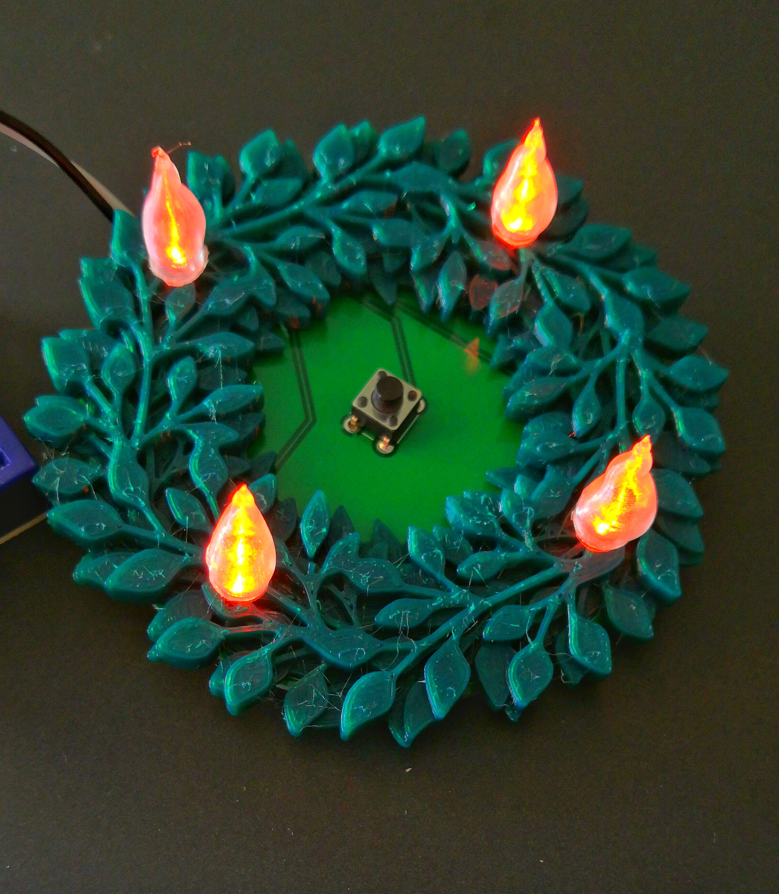

Einfache Platine für einen Adventskranz mit vier LEDs
=====================================================

Die Platine ist eine leichte Lötübung mit vier LEDs, vier
Vorwiderständen und einem Button.

Die Steuerung erfolgt hier (Branch `pic`) über einen
PIC-Mikrokontroller. Varianten für andere MCUs sind
einfach möglich und betreffen nur die Verdrahtung
der Pins.

Schaltung und Layout
--------------------

Grünzeug aus dem 3D-Drucker
---------------------------

Als "Zubehör" gibt es einen Kranz aus dem 3D-Drucker (Datei
`pcb-adventskranz.stl`).

Quelle: <https://www.tinkercad.com/things/6teYZAPliXV>

(Remix aus:
<https://www.tinkercad.com/things/dioOVePNGom-adventskranz-wreath-terrific-hango-lappi>

Flamme aus dem 3D-Drucker
-------------------------

In transparentem PLA gedruckt, macht sich eine "Flamme" auf der LED
sehr schön (Datei Flamme_5.1mm.stl). Das ist eine für 5mm-LEDs passend
skalierte Version von
<https://www.prusaprinters.org/prints/21546-candle-flame-for-vase-mode>.

Firmware
--------

Die Firmware befindet sich im Verzeichnis `firmware`, die Quellen im
Verzeichnis `firmware/src`. Für die Erstellung der Hex-Datei ist entweder
der SDCC, oder der xc8 sowie die PIC-Toolchain aus
<https://github.com/bablokb/pic-toolchain> notwendig.

Lizenz
------

Die Originalmodelle stehen unter der Lizenz ihrer Schöpfer, soweit
angegeben und verfügbar.

Die Lizenz der Platinen und eigenen Entwürfe steht unter der CC-BY-SA
Lizenz.

Shield: [![CC BY-SA 4.0][cc-by-sa-shield]][cc-by-sa]

This work is licensed under a
[Creative Commons Attribution-ShareAlike 4.0 International
License][cc-by-sa].

[![CC BY-SA 4.0][cc-by-sa-image]][cc-by-sa]

[cc-by-sa]: http://creativecommons.org/licenses/by-sa/4.0/
[cc-by-sa-image]: https://licensebuttons.net/l/by-sa/4.0/88x31.png
[cc-by-sa-shield]:
https://img.shields.io/badge/License-CC%20BY--SA%204.0-lightgrey.svg
