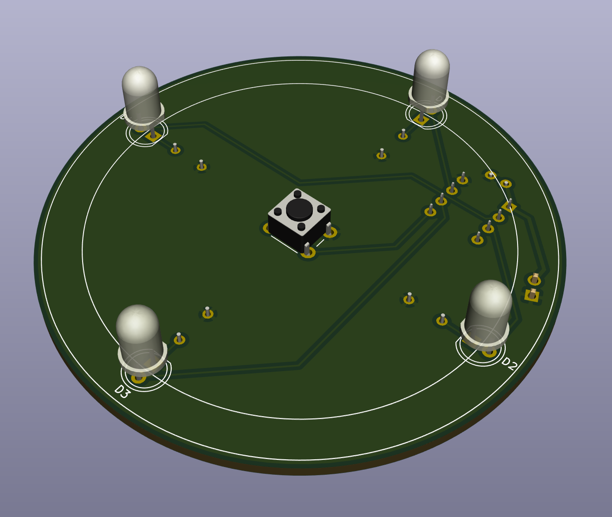
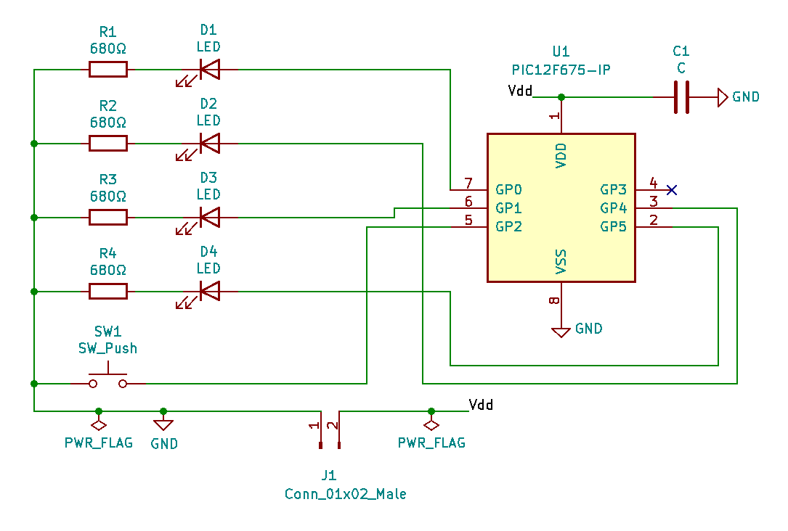
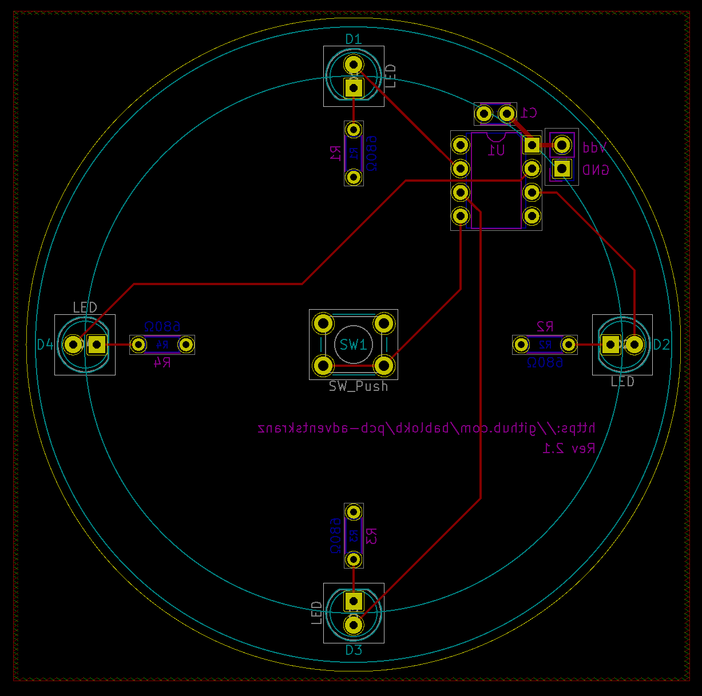

Einfache Platine für einen Adventskranz mit vier LEDs
=====================================================

Die Platine ist eine leichte Lötübung mit vier LEDs, vier
Vorwiderständen und einem Button.

Die Steuerung erfolgt hier (Branch `pic`) über einen
PIC-Mikrokontroller. Varianten für andere MCUs sind
einfach möglich und betreffen nur die Verdrahtung
der Pins.

Schaltung und Layout
--------------------

Grünzeug aus dem 3D-Drucker
---------------------------

Als "Zubehör" gibt es einen Kranz aus dem 3D-Drucker.

(zumindest in der Zukunft, das ist Work-in-Progress).

