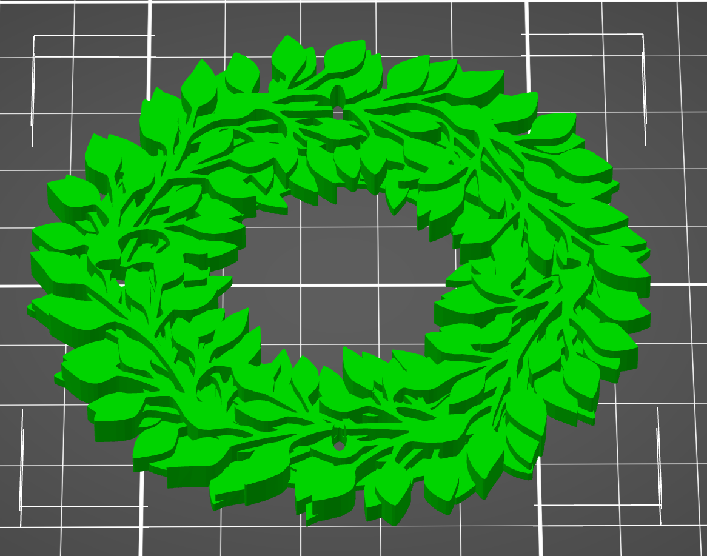

Einfache Platine für einen Adventskranz mit vier LEDs
=====================================================

Die Platine ist eine leichte Lötübung mit vier LEDs, vier
Vorwiderständen und einem Button.

Die Steuerung erfolgt hier (Branch `pic`) über einen
PIC-Mikrokontroller. Varianten für andere MCUs sind
einfach möglich und betreffen nur die Verdrahtung
der Pins.

Schaltung und Layout
--------------------

Grünzeug aus dem 3D-Drucker
---------------------------

Als "Zubehör" gibt es einen Kranz aus dem 3D-Drucker (Datei
`pcb-adventskranz.stl`).

Quelle: <https://www.tinkercad.com/things/6teYZAPliXV>

(Remix aus:
<https://www.tinkercad.com/things/dioOVePNGom-adventskranz-wreath-terrific-hango-lappi>

Firmware
--------

Die Firmware befindet sich im Verzeichnis `firmware`, die Quellen im
Verzeichnis `firmware/src`. Für die Erstellung der Hex-Datei ist entweder
der SDCC, oder der xc8 sowie die PIC-Toolchain aus
<https://github.com/bablokb/pic-toolchain> notwendig.
